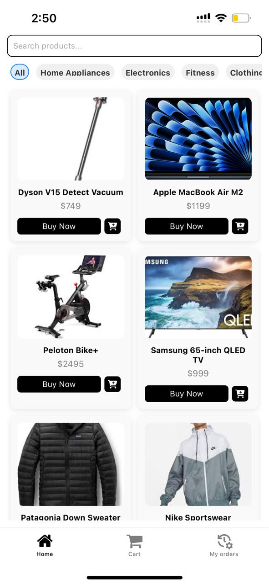
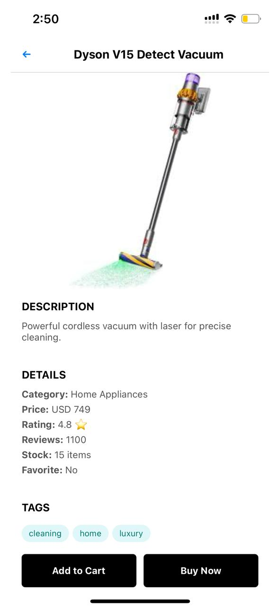
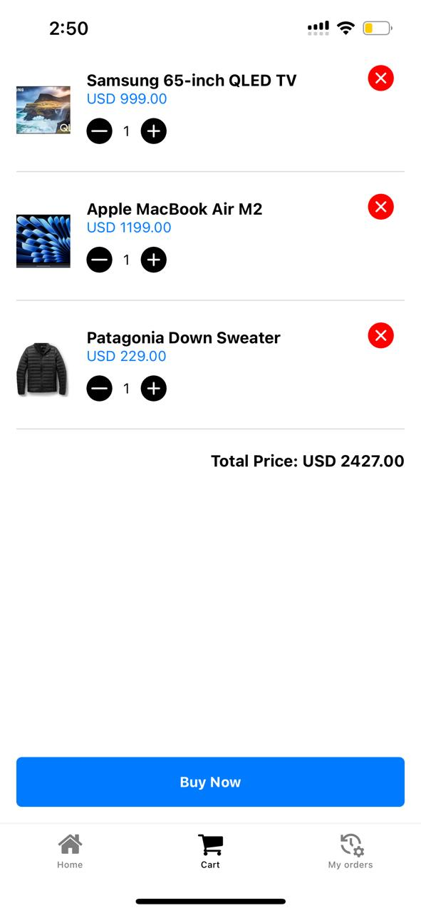
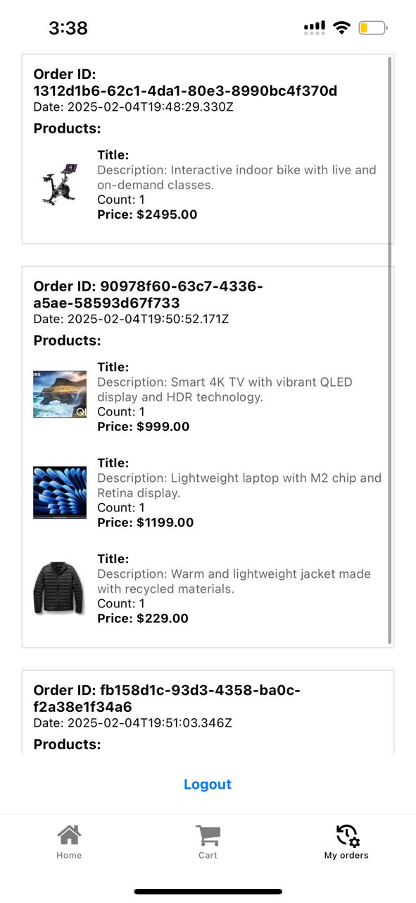

# React Native E-Commerce App

## Overview
This is a fully functional eCommerce application built with React Native. Users can log in using **Google** and **Apple authentication** (via Clerk), browse products, add items to their cart, and complete purchases.

## Screen Shots

<table>
  <tr>
    <td>
      <h3>Auth Screen</h3>
      <p>Allows users to sign in using Google or Apple authentication via Clerk.</p>
      
    </td>
    <td>
      <h3>Home Screen</h3>
      <p>Displays a list of available products with essential details.</p>
      
    </td>
  </tr>
  <tr>
    <td>
      <h3>Product Screen</h3>
      <p>Shows detailed information about a selected product, including images, price, and description.</p>
      
    </td>
    <td>
      <h3>Cart Screen</h3>
      <p>Displays products added to the cart and provides an option to proceed to checkout.</p>
      
    </td>
  </tr>
  <tr>
    <td>
      <h3>Orders Screen</h3>
      
    </td>
  </tr>
</table>

## Features
- **User Authentication**: Google and Apple login powered by **Clerk**.
- **State Management**: Implemented with **Redux** for efficient data flow.
- **Product Listing**: Display products dynamically.
- **Cart Management**: Add, remove, and update items in the cart.
- **Checkout Process**: Secure purchase flow.
- **Firebase Integration**: Real-time data updates and secure transactions.

## Tech Stack
- **React Native**: Cross-platform development.
- **Clerk**: Authentication management.
- **Redux**: State management.
- **Firebase**: Database and backend services.

## Installation
1. Clone the repository:
   ```sh
   git clone https://github.com/your-repo-url.git
   ```
2. Navigate to the project folder:
   ```sh
   cd ecommerce-app
   ```
3. Install dependencies:
   ```sh
   npm install
   ```
4. Run the application:
   ```sh
   npx react-native run-android  # For Android
   npx react-native run-ios      # For iOS
   ```


